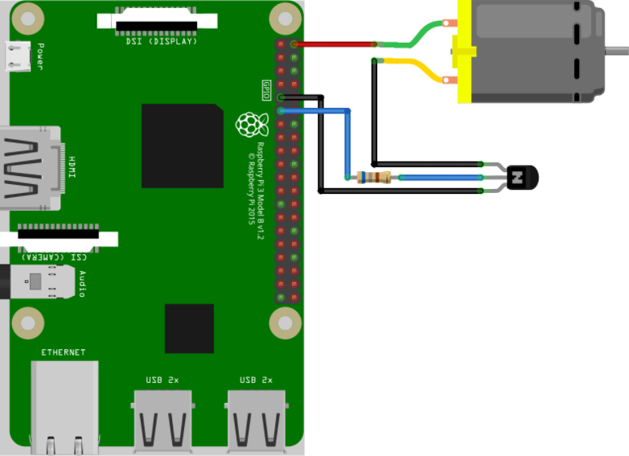

# Raspberry Pi Fan Control (Bash + Cron)

Simple Raspberry Pi fan control using bash. Inspired by [these instructions](https://howchoo.com/g/ote2mjkzzta/control-raspberry-pi-fan-temperature-python) and [code](https://github.com/Howchoo/pi-fan-controller).

## The Circuit

You just need a NPN transistor (2N2222) and 680Ω resistor to convert a dumb fan to one that turns on on a temperature threshold.



[_Image Credits_](https://howchoo.com/g/iote2mjkzzta/control-raspberry-pi-fan-temperature-python)

## Installation

Clone the repository to a local directory by running the following commands.

```shell
git clone https://github.com/shanec-/pi-fan-control.git
cd pi-fan-control
```

Optionally

- Update the `fancontrol.sh` file and update the minimum temperature `MIN_TEMP` and gpio pin `GPIO_PIN`.
- Update `install.sh` file and adjust the cron job interval to suit your requirement.

Run the following commands to install the cron job.

```shell
chmod +x install.sh
./install.sh
```

Run `crontab -l` to verify that it was installed successfully.
